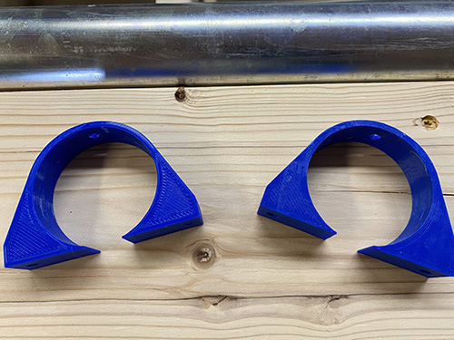
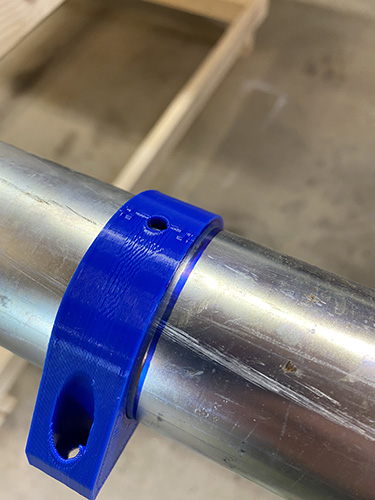
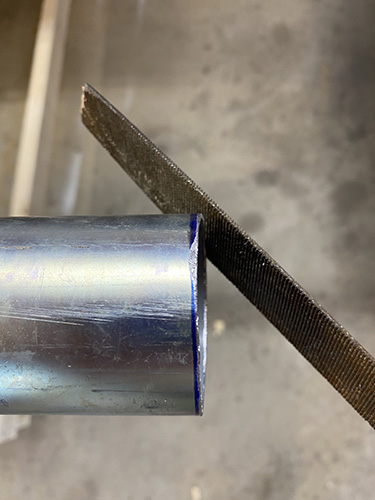
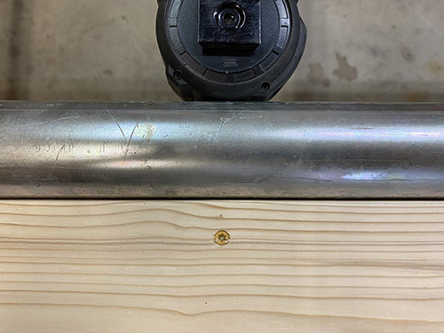
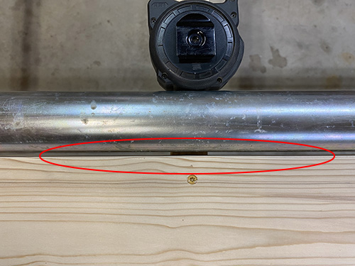
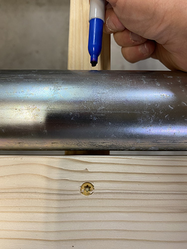
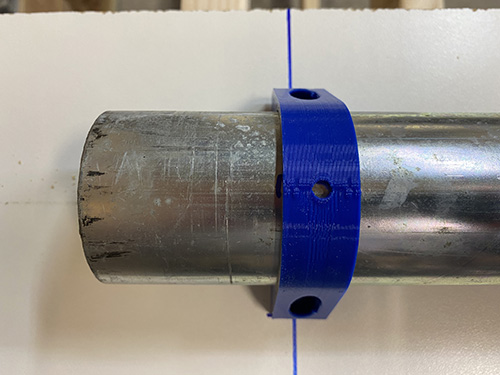
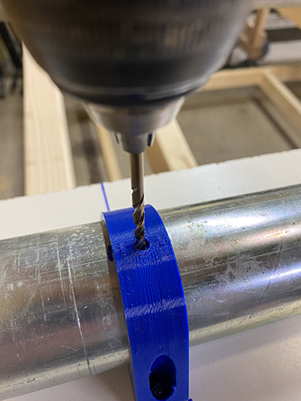
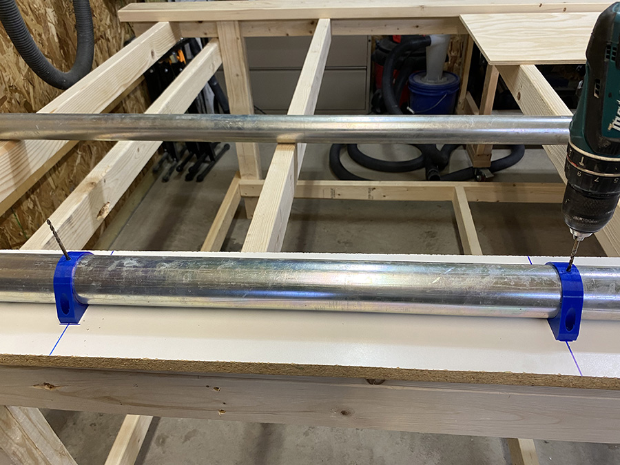

# Using to Jig to add rails to the workbench

Figure out how you're going to attach the conduit stand-offs to the condut. I'm using self-tapping screws, but I'll drill pilot hole in the conduit first using the jigs.  You can also get an M5 tap and a 4.5mm drill bit and make threaded holes. It's up to you, but before you do any drilling, figure out what you're going to attach the stand-offs with. You'll need something threaded so you can slightly adjust the stand-offs as you attach them at the end.

# Step 1
* Purchase two 10 foot pieces of 2" EMT conduit. It's metallic thin-wall conduit, and should be about 2-3/16" OD.
* Print 2 of the jig.stl files
    * Print using 20% infill out of PLA or something similar. These won't be used as part of the actual CNC machine, so it's ok to skimp here

# Step 2
Using the jig, mark a line at 9' on the conduit, and cut at that length, it'll give you a nice line to follow when cutting with a hack saw or sawz-all

# Step 3
Using a file or sand paper, clean up the ends of the pipe, they'll be sharp

# Step 4
Most likely, you're conduit will have a slight bend along the length. Using a board with a flat edge, find the crown on the pipe by slowly rotating the pipe against the board. Note the opposite of the pipe where you have the greatest gap when laying up against the board.  This way when attaching your clips to the conduit, the can be parallel to the bend and make it easier to pull the bend out of the pipe as you screw it down to the workbench.

Here you can see this side of the pipe doesn't have a bend in it

As I continued to rotate the pipe, this shows the crown, and I marked the opposite side

Here I marked 180 deg. from where the bend was the greatest against the straight edge. This point will become the side that I want to install the conduit mounts on.

# Step 5
Let's put the jigs to use. Figure out how often you want to space the conduit stand-offs on the piece of pipe, you'll need to know that for buidling the jig.  I chose to space my stand-offs around 21".

On your flat board that you'll attach the jigs to, measure the distance you want to space the jigs and make a mark on the board.  

Slide your jigs over the conduit, and place them on the marks you made on the board.  Right now, spacing on the pipe itself it's important, we're just focusing on attaching the jigs to the board, and the pipe is there to make sure they are lighed up properly. Screw the jigs down to the board at the spacing you set.  One side can be screwed down tight, but leave a few turns left when you screw down the other side of the jig. This will allow the pipe to slide.

# Step 6
I left 2" at the end of the pipe before drilling a hole for the first conduit stand-off. You'll need to leave yourself some space for the long-axis belt mount.

Rotate your pipe, so the mark you made on the crown is up.

Mark or drill the first hole in the conduit using the top hole in the jig.

# Step 7
After drilling one hole, place a screw, bolt, or spare drill bit into the hole, so the pipe doesn't move, and drill the second hole using the other jig.

# Step 8
Once you drill the 2nd hole, remove the drill bit in the first hole, and slide the pipe down through the jigs so that the 2nd hole now lines up with the hole in the first jig, and put another drill bit or something in that hole to keep the pipe from turning.  

Now drill another hole using the 2nd jig.

Repeat until you reach the end of the pipe.

