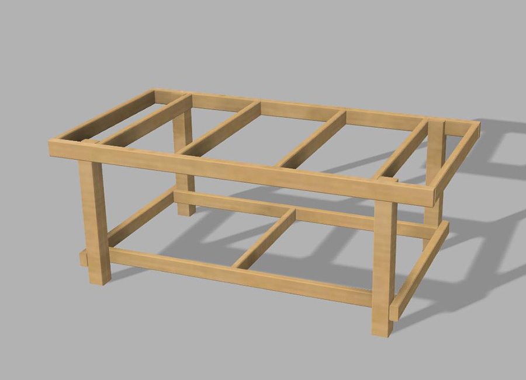

# Building the Bench

Your new Plastic Monstrosity needs something to live on, so this is where we discuss what the table should look like.  Tables and work benches can be made hundreds of different ways, and I'll outline a simple build process for the most basic of tables on which to mount your Monstrosity.

Everyones range of build experience is going to differ here, but at a minimum, since you're attempting to build this monstrosity in the first place, I'll assume you at least have some sort of basic building skills.  For simplicity sake, we'll build a workbench out of 2x4 and 2x6 lumber.

## Basic Requirements

* Simple to build using home-center products (2x4 and 2x6 standard lumber)
* Rigid and built to withstand racking
* Not too heavy to move or properly level
* Able to support full-sheet (4'x8') material

### Where to get stuff
Lowes and Home Depot are going to be your best resources here for the obvious things like lumber, and support braces.

Check places for Amazon for things like leveling feet, or lockable casters if you want to move the monstrosity around.

Some ideas to get you started:

* [4" Heavy Duty Casters with Leveling Feet](https://www.amazon.com/SPACECARE-360-Degree-Polyurethane-Adjustable-Leveling/dp/B07RDPSNYR/)
* [2" Locking Swivel Casters](https://www.amazon.com/Swivel-Caster-Wheels-Locking-Polyurethane/dp/B06Y49D2J2/)
* [Leveling Feet](https://www.amazon.com/Adjustable-Furniture-Levelers-Shelving-Cabinets/dp/B06ZXSXL5Z)

## The Design

I got the basic idea from Kreg tool for these workbench plans: https://www.buildsomething.com/plans/P615A51E86DAF5AD5/DIYWorkbench though I've designed several other workbenches in the past on my own.

You can use the above guide and expand it to fit the plastic monstrosity.  We're aiming for about 5'-6" wide by 9' long, and 38" high is a good height for me, but pick something that works for you.

> Overall table size should be around 5-6" x 9' (66" wide by 108" long)

The original creator used a workbench made out of 2x6 material and simpson strongties from Home Depot, but we're going to simplify the design a little.

## Step 1

Cut list:

For a 38" high bench, you'll need to make **4 of the following legs**:
* 1x 38" long (or however high you want your bench to be) 2x4 
* 1x 34-1/2" long (3-1/2" shorter than the bench height) 2x4

Nail the shorter piece to the front of the longer piece, with the bottoms being flush

## Step 2

Cut List:

If you are making a full-sheet length CNC machine, you'll want you bench to be 9' (108") long

* 2x  108" long 2x4

Attach your long board into the notch that was created by the legs. I placed my legs 14" in from either side on the board.

## Step 3

Cut List:

* 2x 66" long 2x4 (this will be the maximum width of the table)
* 2x 80" long 2x4 (bottom support)

Attach your 66" board across the 2 sets of bench uprights you created in step 2. Put it about 6" off the floor, and attach it so the outer edges are flush with the outer edges of the legs.

Take the 80" long board and attach it inside the legs, flush with the back of the other support board you just added

## Step 4

Cut List:
* 2x 63" long 2x4 (the width of your table from step 3, minus 3")

Attach these boards at the top inside of the legs, use a level to make your uprights plumb.

## Step 5

Cut List: 
*4x 63" long 2x4s
*1x 57" long 2x4

These will be part of your material supports, place one at each end of the bench, and space the others evenly across the length of the bench.  You can make more if you want more support for whatever material you are cutting.

Take the 57" long 2x4 and use it to stretch across the bottom supports in the middle to stabalize those supports

## Step 6

Cut List:
* 2x 108" long 2x6 (or whowever long you made your bench)

This is the support for your long-axis rails. Attach either 2x6 to the top of the bench, flush to the outer sides, and flush with the long horizontail rails.

## Completed Bench
*shown with long-axis EMT conduit

