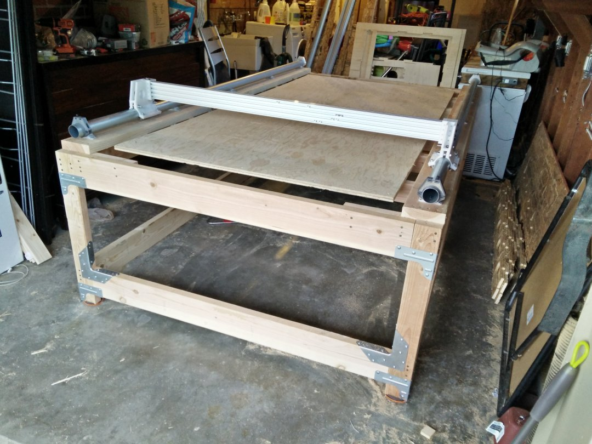

# Building the Table

Your new Plastic Monstrosity needs something to live on, so this is where we discuss what the table should look like.  Tables and work benches can be made hundreds of different ways, and I'll outline a simple build process for the most basic of tables on which to mount your Monstrosity.

Everyones range of build experience is going to differ here, but at a minimum, since you're attempting to build this monstrosity in the first place, I'll assume you at least have some sort of basic building skills.  For simplicity sake, we'll build a workbench out of 2x4 and 2x6 lumber.

## Basic Requirements

* Simple to build using home-center products (2x4 and 2x6 standard lumber)
* Rigid and built to withstand racking
* Not too heavy to move or properly level
* Able to support full-sheet (4'x8') material

### Where to get stuff
Lowes and Home Depot are going to be your best resources here for the obvious things like lumber, and support braces.

Check places for Amazon for things like leveling feet, or lockable casters if you want to move the monstrosity around.

Some ideas to get you started:

* [4" Heavy Duty Casters with Leveling Feet](https://www.amazon.com/SPACECARE-360-Degree-Polyurethane-Adjustable-Leveling/dp/B07RDPSNYR/)
* [2" Locking Swivel Casters](https://www.amazon.com/Swivel-Caster-Wheels-Locking-Polyurethane/dp/B06Y49D2J2/)
* [Leveling Feet](https://www.amazon.com/Adjustable-Furniture-Levelers-Shelving-Cabinets/dp/B06ZXSXL5Z)

## The Design

I got the basic idea from Kreg tool for these workbench plans: https://www.buildsomething.com/plans/P615A51E86DAF5AD5/DIYWorkbench though I've designed several other workbenches in the past on my own.

You can use the above guide and expand it to fit the plastic monstrosity.  We're aiming for about 5'-6" wide by 9' long, and 38" high is a good height for me, but pick something that works for you.

> Overall table size should be around 66" wide by 108" long

The original creator used a workbench made out of 2x6 material and simpson strongties from Home Depot.:

